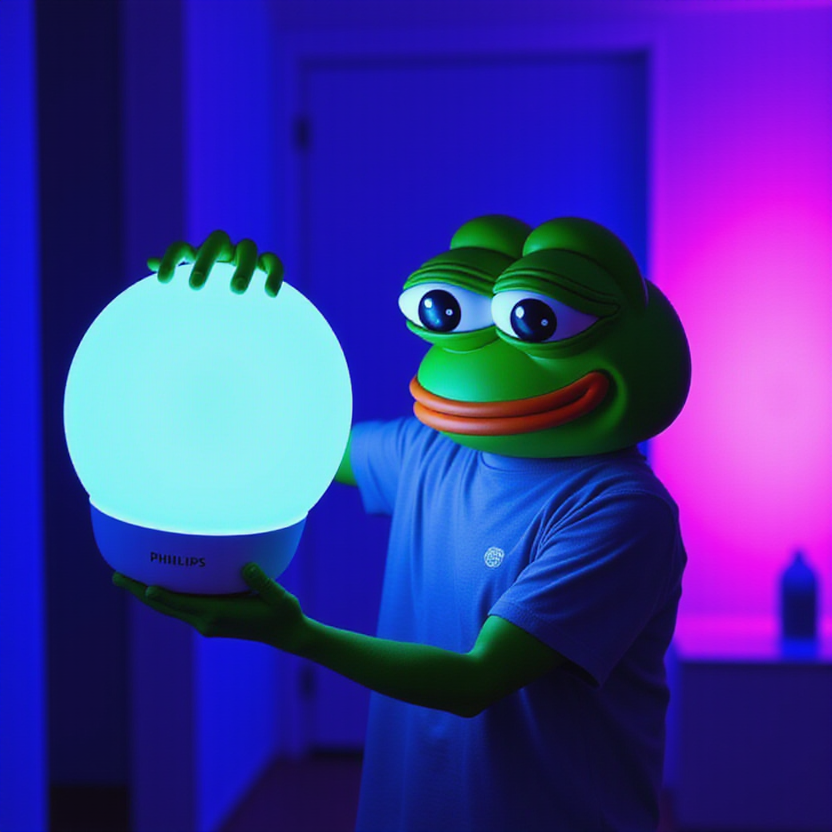
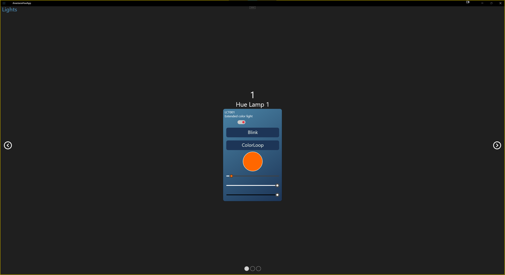

  

<h3 align="center">AnastasiaHueApp</h3>

  
  
  

A practical stylized Android & Windows app to control Philips Hue Lights using the <a href="https://developers.meethue.com/develop/hue-api/lights-api/">Hue API V1</a>

  

## 📝 Table of Contents
- [About](#about)
- [Usage](#usage)
- [Built Using](#built_using)
- [Authors](#authors)

## 🧐 About 
AnastasiaHueApp lets you control the Philips Hue Lights you connect to on the Bridge. The app was designed using MVVM principles, union architecture and test driven mobile development.

### Why?! 😱
This was an assigment for university.

### Features 🌟
- Support for both **Android** and **Windows**!
- **Control** your Hue lights with **ease**.
- **Beautiful** UI.
- Works with both real lights and the [Hue Emulator](https://github.com/SteveyO/Hue-Emulator).
- Unit testing using **MSTest**, **Moq** & **FluentAssertions**.

## 🎈 Usage 
1. Open the app.
1. Connect to the Hue Bridge by pressing the physical button the device, then pressing the connect button on the main page of the app.
1. Wait to be automatically directed to the lights page.
1. Enjoy!

## ⛏️ Built Using 
- [Visual Studio](https://visualstudio.microsoft.com/) - IDE used
- [C#](https://dotnet.microsoft.com/en-us/languages/csharp) - Language used to program in
- [MAUI](https://dotnet.microsoft.com/en-us/apps/maui) -  Framework used to build native, cross-platform desktop and mobile apps from a single C# codebase for Android, iOS, Mac, and Windows
- [CommunityToolkit.Mvvm](https://github.com/CommunityToolkit/MVVM-Samples) - Modern, fast, and modular MVVM
- [CommunityToolkit.Maui](https://github.com/CommunityToolkit/Maui) - The .NET MAUI Community Toolkit is a community-created library that contains .NET MAUI Extensions, Advanced UI/UX Controls, and Behaviors to help make your life as a .NET MAUI developer easier
- [CardsView.MAUI](https://github.com/AndreiMisiukevich/CardView.MAUI) - CardsView | CarouselView | CoverflowView | CubeView for .NET Maui
- [FluentAssertions](https://fluentassertions.com/) - A very extensive set of extension methods that allow you to more naturally specify the expected outcome of a TDD or BDD-style unit tests
- [Moq](https://github.com/devlooped/moq) - The most popular and friendly mocking framework for .NET
- [Serilog](https://serilog.net/) - Flexible, structured events — log file convenience
- [Newtonsoft Json.NET](https://www.newtonsoft.com/json) - Popular high-performance JSON framework for .NET

## ✍️ Authors 
- [@pkg-dot-zip](https://github.com/pkg-dot-zip) - Idea & Initial work.

See also the list of [contributors](https://github.com/pkg-dot-zip/AnastasiaHueApp/contributors) who participated in this project.
